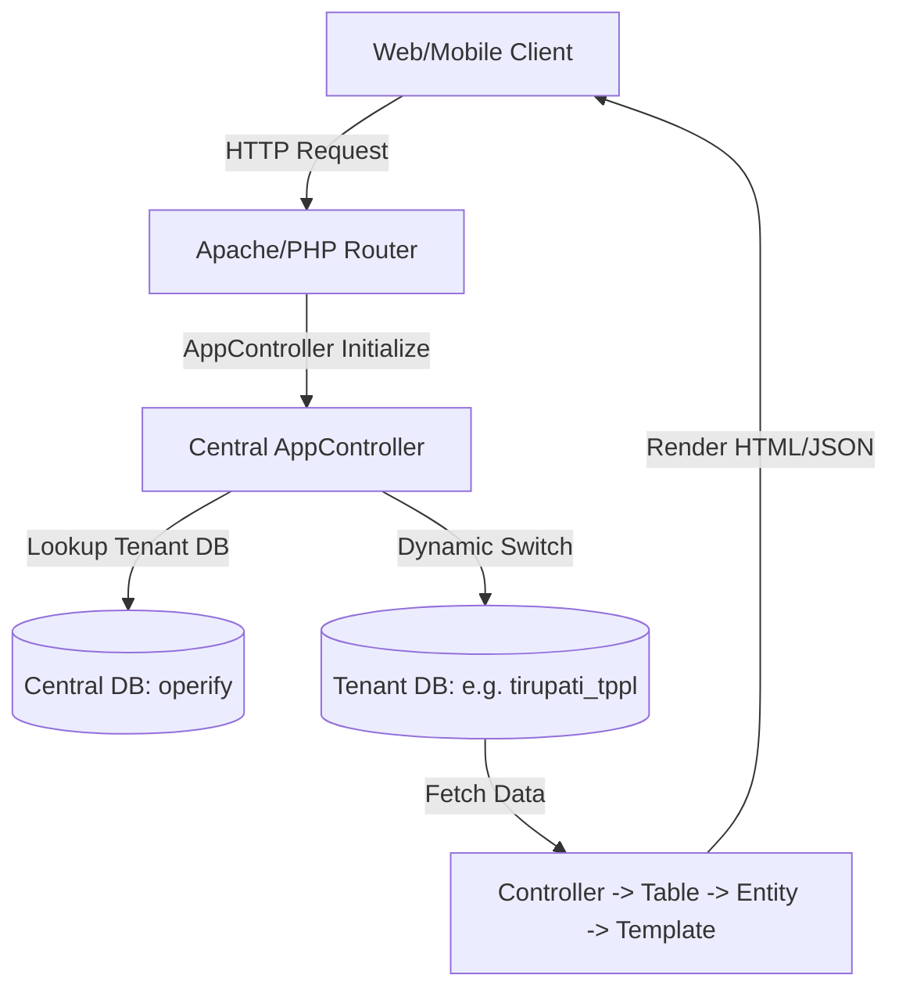

# 01 Project Analysis: CakePHP ERP System Analysis

This document provides a comprehensive technical analysis of the legacy multi-tenant ERP system built on CakePHP 3.3. It details the architecture, code structure, module breakdown, custom utilities, database mappings, and critical workflows.

---

## 1. Project Architecture

The legacy application is a **multi-tenant ERP system** using a single-application codebase connected to multiple MySQL databases. It consists of:
*   **Central Database (`operify`)**: Used for tenant metadata, central user login records, database routing definitions, global settings, and platform configuration.
*   **Tenant Databases (e.g., `tirupati_tppl`)**: Contains branch-specific transactional data (stock register, purchase orders, bill of materials, employees, payroll, and local school logs).



### Multi-Tenancy Connection Switching Flow
1.  **Request Lifecycle**: Every request triggers `AppController::initialize()`.
2.  **Lookup Session/Context**: The system reads the logged-in user's database name (`Auth.User.db`) and role ID (`Auth.User.role_id`).
3.  **Connection Dropping & Aliasing**: If a specific tenant database (`$community`) is active and the user is not a SuperAdmin (role ID `101`), the default connection configuration is dropped using `ConnectionManager::drop('default')`.
4.  **Configuring Tenant Connection**: A new connection profile is created pointing to the tenant-specific database while using the central database server's credentials (`DBHOSTNAME`, `MYSQLUSERNAME`, `MYSQLPASSWORD`).
5.  **Aliasing**: The tenant connection is aliased as `'default'` so that subsequent Cake ORM operations run against the tenant's database schema.

---

## 2. Folder Structure

The directory structure of the legacy CakePHP codebase is organized as follows:

```text
operify-cake-php-old-project/
├── bin/                       # CakePHP CLI execution scripts
├── config/                    # Configuration files
│   ├── app.php                # Database connections, logging, and security salts
│   ├── bootstrap.php          # Codeboot constants (SITE_URL, central DB names)
│   ├── paths.php              # Paths definitions
│   ├── routes.php             # Routing configuration
│   └── schema/                # Legacy translation schema (i18n.sql, sessions.sql)
├── outputs/                   # Analysis outputs (inventories and roadmaps)
│   └── migration_analysis/
├── src/                       # Main source code directory
│   ├── Application.php        # Core HTTP Application wrapper
│   ├── Controller/            # Application controllers
│   │   ├── Admin/             # 69 controllers for ERP admin portal
│   │   ├── Api/               # API controllers for mobile client
│   │   ├── AppController.php  # Global controller base class (common utils, tenant switching)
│   │   ├── LoginsController.php # Central login and authentication logic
│   │   ├── CronController.php   # Database backup utility and mailing scripts
│   │   └── MobileController.php # ERP mobile API endpoints
│   ├── Model/                 # Database access layer
│   │   ├── Table/             # 192 model files definition schema validation and associations
│   │   └── Entity/            # Entity classes defining model custom business getters
│   ├── View/                  # custom view classes
│   └── Template/              # 638 View Templates (.ctp files)
├── vendor/                    # PHP dependencies (PHPMailer, PhpSpreadsheet, TCPDF, etc.)
└── webroot/                   # Publicly accessible folder
    ├── DbBackup/              # Staging directory for database backup ZIP files
    ├── css/ & js/             # Static styles and traditional javascript dependencies
    ├── img/                   # Static images
    └── uploads/               # Dynamic uploads (documents, employee photos, signatures)
```

---

## 3. Comprehensive Module Breakdown

The system is composed of the following modules:

### 1. Authentication & Session Management
*   **Controller**: `LoginsController.php`, `AppController.php`
*   **Database Tables**: `users`, `schools`, `roles`
*   **Logic**:
    *   Authentication is triggered by mobile/password or email/password.
    *   Verifies user against the central database (`operify.users`) using the plain text column `confirm_pass` (legacy check) or hashed password logic.
    *   Retrieves the target tenant database (`db`) and configures a dynamic connection to it.
    *   Checks for duplicate mobile numbers inside the tenant database to prevent identity collisions.
    *   Loads user session and redirects to dashboards based on Role IDs.

### 2. Authorization & Roles
*   **Controllers**: `PermissionController.php`, `PermissionmodulesController.php`, `RolesController.php`
*   **Database Tables**: `roles`, `permission_module`, `permissions`, `permission_access`, `permission_label`
*   **Logic**:
    *   **Auto-Registration of Actions**: `AppController::check_permission()` monitors incoming request paths. If a controller/action does not exist in `permission_module`, it dynamically inserts it and links it to role permission entries.
    *   **Access Control check**: `AppController::checkfinalpermission()` validates if the user's role has the permission flag (`permission = 'Y'`) for the current action. Whitelisted actions (e.g., searches) are bypassed. Failed permissions redirect the user to `/Error/errorfound` or role-specific fallbacks.

### 3. Dashboard
*   **Controller**: `DashboardsController.php`
*   **Logic**: Renders key performance indicators (KPIs) for branch admins and center heads. Loads dynamic statistics from purchasing, inventory, production, and branch operations. Visualizes trends using dynamic pie charts (Morris.js, CanvasJS).

### 4. Geography Masters
*   **Controllers**: `CountryController.php`, `StatesController.php`, `CitiesController.php`
*   **Database Tables**: `country`, `states`, `cities`
*   **Logic**: Centralized directories managing geographical scopes. Manages state-wise classifications for CGST/SGST/IGST tax computations.

### 5. Item Masters
*   **Controllers**: `ItemcategoryController.php`, `ItemlocationController.php`, `ItemnameController.php`, `AdditemController.php`, `StoreitemsController.php`, `CategorywiseController.php`
*   **Database Tables**: `st_categorymaster`, `st_itemlocation`, `st_itemname`, `st_additem`, `st_storeitem`, `st_sizemanager`, `st_taxmaster`, `st_measurementunits`
*   **Logic**: Handles item definitions, pricing brackets, tax rates, and sizes. Categorizes items into sub-locations (racks/shelves) and sub-categories.

### 6. Vendor & Supplier Masters
*   **Controllers**: `VendorsController.php`, `SuppliersController.php`, `TransporterController.php`
*   **Database Tables**: `vendors`, `st_vendorshipfrom`, `st_vendorbillto`, `st_supplier`, `transporter`
*   **Logic**: Stores profiles of raw material suppliers and transport logicians, including billing addresses, shipping addresses, payment terms, and GST details.

### 7. Procurement & Contracts
*   **Controller**: `ContractsController.php`
*   **Database Tables**: `contracts`, `bom`, `designsheet`, `st_supplier`
*   **Logic**: Manages client and vendor procurement contracts. Features search tools to fetch specific items from contracts, check expenditures, and display a reverse lookup view.

### 8. Design Sheets & Bills of Materials (BOM)
*   **Controllers**: `DesignsheetController.php`, `ProductionController.php` (methods `addbom`, `editaddbom`, `billsofmaterials`)
*   **Database Tables**: `designsheet`, `designsheetdetails`, `bom`, `bom_finisedproduct`, `bom_rawmaterial`, `finishedproduct_process`
*   **Logic**:
    *   **Design Sheets**: Specifies product physical constraints (weights, diameters, insulation specifications).
    *   **BOM Builder**: Formulas to map how many raw materials (and wastage percentages) are consumed to manufacture a unit of finished product.

### 9. Indent & Indent PO
*   **Controllers**: `IndentController.php`, `IndentpoController.php`, `ReverseindentController.php`
*   **Database Tables**: `st_indentmaster`, `st_indentmaster_temp`, `st_indentpreview`, `indentpo`, `reverseindent`
*   **Logic**:
    *   Requisitions raised by departments are stored in draft tables (`st_indentmaster_temp`) and approved into main tables (`st_indentmaster`).
    *   `IndentpoController` matches active indents with available inventory levels and links them directly to purchase order drafts.

### 10. Quotation & Bidding Workflow
*   **Controller**: `QuotationController.php`
*   **Database Tables**: `st_quotations`, `st_quotations_details`, `st_send_quotations`, `st_received_quotations`, `st_received_quotations_details`
*   **Logic**: Publishes RFQs (Request for Quotations) to multiple suppliers. Collects bid rates, terms, and tax schedules from vendors. Automatically highlights bidded vendor rates for award analysis.

### 11. Purchase Orders (PO)
*   **Controller**: `PurchaseorderController.php` (42 actions)
*   **Database Tables**: `st_purchaseorder`, `st_purchaseorderDetails`, `st_purchaseorder_temp`, `po_delivery_note`
*   **Logic**: Core transactional engine. Manages PO drafting, vendor assignment, currency adjustments, tax additions, revisions (`revised`, `revisedV1`), PDF generations, and delivery note schedules.

### 12. Goods Received Note (GRN) & Quality Check (QC)
*   **Controller**: `GoodsreceivedController.php`, `InspectionController.php`
*   **Database Tables**: `st_goodsreceive`, `grn_inspection`, `grn_inspection_details`, `st_stock_register`, `st_inspection_report`
*   **Logic**:
    *   Logs incoming warehouse shipments against active PO numbers.
    *   **QC Inspections**: Inspection records verify whether items match dimensions, electrical specs, and weight tolerances. Splits quantities into accepted, rejected, or conditional holds.

### 13. Stock Register & Inventory
*   **Controllers**: `StockregisterController.php`, `StorelocationpermissionController.php`
*   **Database Tables**: `st_stock_register`, `st_stock_available`, `st_store_location_permission`
*   **Logic**:
    *   The primary inventory ledger. Registers additions (GRN, returns) and issues (production release, branch shipments).
    *   Tracks dynamic available stock snapshots in `st_stock_available`.
    *   Enforces store managers' access rights to specific warehouse racks.

### 14. Branch Requests & Point of Sale (POS)
*   **Controllers**: `BranchitemrequestController.php`, `SalesController.php`, `SolditemsController.php`, `SalereturnController.php`
*   **Database Tables**: `tempbranchrequest`, `st_mrn`, `solditems`, `solditemsdetail`, `salesreturn`, `salesreturndetails`, `tempsold_items`
*   **Logic**:
    *   Branches request items from the head office. Fulfillments generate Material Receipt Notes (MRN) and deduct warehouse stock.
    *   Point of sale forms process instant retail sales, generate invoices, deduct stock, and manage cash collections.

### 15. Maintenance
*   **Controller**: `MaintenanceController.php`
*   **Database Tables**: `maintenance`, `machine_master`
*   **Logic**: Schedules machine maintenance routines. Tracks downtime, repairs, odometer/hour-meter readings, and notifies supervisors of maintenance completions.

### 16. EMD & Payments
*   **Controllers**: `EmdController.php`, `PaymentmanagerController.php`, `PaymentsController.php`
*   **Database Tables**: `emd_amount`, `emd_guarantees`, `emd_remarks`, `payments`, `particular_payments`, `particular_pay_receive`
*   **Logic**: Logs Earnest Money Deposits (EMDs) submitted for government tenders. Tracks bank guarantees, maturity dates, and refunds. Manages accounting ledgers for vendor bills and payment voucher settlements.

### 17. Employees & Payroll
*   **Controller**: `EmployeesController.php` (52 actions)
*   **Database Tables**: `employees`, `departments`, `designations`, `employeeattendance`
*   **Logic**: Manages employee profiles, onboarding data, shift rosters, daily attendance, payroll calculations, certificate creations (relieving certificates, no-dues clearance), and salary adjustments.

### 18. Data Imports & Exports
*   **Controller**: `DatarecordController.php`
*   **Logic**: Processes bulk Excel file uploads to populate masters (items, category listings, vendor lists, employee registers, legacy student profiles). Performs validation dry-runs and records insert counts.

### 19. Reports
*   **Controllers**: `ReportController.php` (264 actions), `ReportNewController.php` (57 actions)
*   **Logic**: Massive reports catalog extracting and grouping ERP indicators, sales reports, inventory levels, salary registers, attendance, and legacy school modules (fees, library transactions). Feeds search filters, groupings, subtotals, and exports them via PHPExcel/TCPDF.

---

## 4. Key Shared Integrations & Utilities

*   **Mail Engine (PHPMailer)**: Centralized in `AppController::send_email()`. Configures SMTP authentication parameters using Google SMTP hosts (`Host = smtp.gmail.com`, Port `587`) and manages attachment files.
*   **WhatsApp API (Ultramsg)**: Unified in `AppController::whatsappmsg()` and `AppController::supperadminwhatsapp()`. Sends transactional updates (purchase orders, dispatch notices) by communicating with Ultramsg REST API endpoints.
*   **FCM Push Notifications**: Centralized in `AppController::sendNotification()`. Uses Google Service Account keys (`WWW_ROOT/operify-cad4a-d47af56c4f8a.json`) and fetches OAuth 2.0 access tokens dynamically to deliver push alerts to client devices.
*   **Emoji Stripper**: `AppController::removeEmojis($text)` strips emoticons from inputs using regular expressions to prevent database charset errors.
*   **Financial Year Calculations**: `AppController::financialyear()` returns standard financial year strings (e.g., `2026-27`) depending on whether the current month is before April.

---

## 5. View & Printing Systems

*   **Legacy View Templates (`.ctp`)**: Renders custom pages using PHP server-side template composition. Uses CakePHP's `FormHelper`, `HtmlHelper`, and `UrlHelper`.
*   **Print Engine**: Built on customized CSS print stylesheets (with page breaks, hides menus, structured grids) for thermal invoices, delivery receipts, and invoices.
*   **PDF Generation**: Utilizes mPDF and TCPDF libraries. Receives raw HTML buffers from view templates and compiles them into downloadable PDF attachments.
*   **Excel Exports**: Driven by PHPExcel. Populates cells individually, configures styles, headers, colors, totals, and streams the spreadsheet file to the client.

---

## 6. Scheduled Tasks & Backups

*   **Script**: `CronController.php`
*   **Schedule**: Configured on a system cron daemon to invoke `CronController::dataBaseBackup()`.
*   **Logic**:
    1.  Loops through active databases (`operify`, `tirupati_ebm`, `tirupati_tppl`, etc.).
    2.  For each database, runs a schema and data extraction loop (executes `SHOW TABLES`, `SHOW CREATE TABLE`, and queries data row by row).
    3.  Writes sql files into `webroot/DbBackup/` and permissions them (`chmod 0777`).
    4.  Compresses the sql files into ZIP archives using PHP's `ZipArchive`.
    5.  Emails all ZIP and SQL files to `rahulbishnoi0789@gmail.com` using the configured SMTP.
    6.  Deletes the backup files (`unlink`) to avoid server disk expansion.
