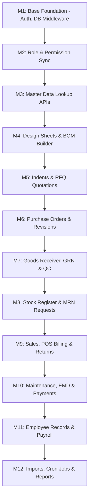

# 02 Migration Plan: CakePHP to Node.js & Next.js ERP Migration

This document provides a comprehensive migration roadmap to transition the legacy CakePHP 3.3 multi-tenant ERP system into a modern architecture using Node.js/Express.js (Backend) and Next.js App Router (Frontend) while preserving the exact database schema, tables, and business logic.

---

## 1. Current Architecture vs. Target Architecture

### Current CakePHP 3.3 Architecture
*   **Routing & Dispatching**: PHP Apache rewrite rule (`.htaccess`) routing to CakePHP dispatcher.
*   **Controller Layer**: MVC controllers mapping routes directly to view logic and handling request parsing.
*   **Database & ORM**: Cake PHP ORM with raw SQL queries executed directly inside controllers using `ConnectionManager::get('default')->execute(...)`.
*   **Session Management**: Standard PHP session cookie-based mechanism.
*   **UI Views**: PHP server-side template pages (`.ctp`) utilizing inline PHP commands, CakePHP helpers, and traditional jQuery layout frameworks (AdminLTE).

### Target Modern Architecture
*   **API Boundary**: Express.js REST API server executing on a secure backend port.
*   **Client Interface**: Next.js App Router server/client layout with responsive Tailwind CSS pages.
*   **Database Layer**: Native SQL queries and migrations using the `mysql2` driver with thread pooling and transactional connections.
*   **Security & Auth**: Stateless JWT auth (Access & Refresh tokens) with Express middleware for permission check.
*   **Dynamic Multi-Tenancy**: Express dynamic database routing middleware mapping tenant identifiers to specific DB pools.

```text
               +-------------------------------------------+
               |             Next.js Frontend              |
               | (React, Axios, Tailwind, React Query, Zod)|
               +-------------------------------------------+
                                     |
                                     v [HTTPS REST + JWT Header]
               +-------------------------------------------+
               |            Express.js Backend             |
               | (Auth & Tenant Middlewares, Controllers)  |
               +-------------------------------------------+
                                     |
                         +-----------+-----------+
                         |                       |
                         v                       v
               +-------------------+   +--------------------+
               | Central DB Pool   |   | Dynamic Tenant DB  |
               |    ('operify')    |   | ('tirupati_tppl')  |
               +-------------------+   +--------------------+
```

---

## 2. Migration Strategy (Module-by-Module)

Migration will be conducted in a **strictly sequential, dependency-first order**. A module's backend, frontend, testing, and documentation must be finalized before moving to the next.



### Milestone Breakdown

#### Milestone 1: Base Foundation (Auth & Dynamic DB)
*   **Scope**: Setup `/backend` and `/frontend` directories. Build tenant-aware MySQL database connection pools. Build JWT login endpoint, token validation, and refresh mechanics.
*   **Target**: Authentication functions using mobile/email passwords, resolving user roles, and protecting endpoints.

#### Milestone 2: Roles & Permission Synchronization
*   **Scope**: Port authorization checking logic. Express middleware checks access controls against the `permission_module` and `permissions` tables.
*   **Target**: Sidebar menu filters and routes restrict views based on active permissions.

#### Milestone 3: Geographical & Master Data Directories
*   **Scope**: Create REST CRUD endpoints and search grids for Countries, States, Cities, Item Categories, Item Locations, Item Names, Sizes, Taxes, and Approved Suppliers.
*   **Target**: Populate reusable dropdowns and select widgets.

#### Milestone 4: Design Sheets & Bill of Materials (BOM)
*   **Scope**: Port Design Sheet spec sheets and BOM formulas.
*   **Target**: Visual BOM builder interface in Next.js showing component compositions and wastage factors.

#### Milestone 5: Procurement Indents & Quotations
*   **Scope**: Replicate Draft Indents (`st_indentmaster_temp`) and Quotation biddings.
*   **Target**: Add request routes, award bidders view, and PO conversion drafts.

#### Milestone 6: Purchase Orders (PO) Lifecycle
*   **Scope**: Migrate the PO generation and PO revision workflows. Maintain exact taxes, item calculations, and discount rules.
*   **Target**: Print-ready PO layout views and export spreadsheets.

#### Milestone 7: Goods Received (GRN) & Quality Control (QC)
*   **Scope**: GRN gate-pass logic and QC checklists matching dimensions and criteria.
*   **Target**: Log item-level pass, conditional hold, or reject reasons.

#### Milestone 8: Stock Register & Material Receipts (MRN)
*   **Scope**: Master ledger calculations (additions, issues, balance checks). MRN branch fulfillments.
*   **Target**: Real-time warehouse availability check dashboard.

#### Milestone 9: POS Billing, Store Sales & Returns
*   **Scope**: Point-of-sale invoicing templates, returns transactions, and cash/payment reconciliations.
*   **Target**: Thermal receipt print-outs and credit note generations.

#### Milestone 10: Maintenance, EMD & Finance Ledgers
*   **Scope**: Machine maintenance alarms, Earnest Money Deposit guarantees logs, and payment voucher settlements.
*   **Target**: Payment import/export scripts and alerts tracker.

#### Milestone 11: Employees & Payroll
*   **Scope**: Staff rosters, daily attendance sheets, Relieving certificates, and salary logs.
*   **Target**: Payroll summary exports.

#### Milestone 12: Data Imports, Cron Jobs & Reports Catalog
*   **Scope**: Port the 320+ reporting actions. Excel/CSV imports parser. System DB backup ZIP and email cron task.
*   **Target**: 100% reporting totals matching old exports.

---

## 3. Dependency Mapping

| Target Module | Dependent On Modules / Prerequisites | Essential Database Tables |
| --- | --- | --- |
| **Auth / Session** | Central Database Initialization | `users`, `schools`, `roles` |
| **Permissions** | Auth, Router registry | `permission_module`, `permissions` |
| **Lookup Masters** | Permissions | `country`, `states`, `cities`, `st_taxmaster`, `st_measurementunits` |
| **Item Masters** | Lookup Masters | `st_additem`, `st_categorymaster`, `st_itemlocation`, `st_sizemanager` |
| **Vendor Masters** | Lookup Masters | `vendors`, `st_vendorbillto`, `st_vendorshipfrom`, `st_supplier` |
| **BOM & Design Sheet**| Item Masters, Vendor Masters | `bom`, `bom_finisedproduct`, `bom_rawmaterial`, `designsheet` |
| **Indents** | Item Masters | `st_indentmaster`, `st_indentmaster_temp` |
| **Purchase Orders** | Indents, BOM, Vendor Masters | `st_purchaseorder`, `st_purchaseorderDetails`, `st_purchaseorder_temp` |
| **GRN / Quality QC** | Purchase Orders, Vendor Masters | `st_goodsreceive`, `grn_inspection`, `grn_inspection_details` |
| **Stock Register** | Item Masters, GRN, Production | `st_stock_register`, `st_stock_available` |
| **Sales & MRN** | Stock Register | `solditems`, `solditemsdetail`, `st_mrn`, `tempbranchrequest` |
| **Production** | BOM, Stock Register | `production`, `productionorder`, `productiondetails` |
| **Reports** | All Modules | All Database Tables |

---

## 4. API & Routing Strategy

We will use RESTful route semantics. Dynamic multi-tenant switching will be handled implicitly by a tenant middleware parsing JWT payloads, rather than passing database parameters in query strings.

### Base Routes Structure
*   `POST /api/auth/login` - Authenticate users and issues access/refresh tokens.
*   `POST /api/auth/refresh` - Requests refreshed access tokens.
*   `GET /api/me/permissions` - Fetches authenticated user's permission matrix.
*   `GET /api/masters/items` - Paginated item listings with search filters.
*   `POST /api/purchasing/orders` - Generates a new purchase order.
*   `GET /api/reports/:reportName/export` - Exports raw report statistics (returns CSV/XLSX/PDF buffers).

---

## 5. Frontend Strategy

*   **Folder Layout**: Next.js App Router folders separated into routing layers:
    *   `(public)`: Contact us and trial request forms.
    *   `(auth)`: Login and forgot/reset password screens.
    *   `(admin)`: Sidebar navigation frame protecting sub-screens.
*   **State Control**: Context API manages auth credentials and active company db. React Query (TanStack Query) handles fetching, caching, and status indicators.
*   **Client vs. Server Components**:
    *   *Server Components*: Static layouts, main sidebar wrappers, page frames.
    *   *Client Components*: Interactive data grids, form structures (React Hook Form + Zod validation), datepickers, modals.

---

## 6. Risk Analysis & Mitigation

| Identified Risk | Impact | Mitigation Action Plan |
| --- | --- | --- |
| **Dynamic DB Switching Latency** | High | Initialize separate connection pools for active tenants in Express. Reuse connection pools rather than spawning new DB connections per request. |
| **Plaintext Passwords Compatibility** | Critical | Legacy CakePHP users have passwords stored in `confirm_pass` in plain text. Maintain compatibility verification on login, but automatically hash the password using `bcrypt` and write it back during the first successful login. |
| **Report Controller Size (814KB)** | High | The legacy report controller is massive. Decompose reporting scripts into independent services inside `/backend/src/services/reports/` (e.g., `payrollReport.js`, `stockReport.js`). |
| **Excel Export Layout Matching** | Medium | Use `exceljs` library in Node.js to configure borders, background cell highlights, column dimensions, and formulas to match old outputs. |
| **PDF Generation Parity** | Medium | Implement standard HTML template components and compile them into PDFs using `puppeteer` or `pdfkit` to match mPDF layouts. |

---

## 7. Testing & Parity Verification

To verify that the migrated Node.js + Next.js system behaves exactly like the legacy CakePHP system:
1.  **Database Parity Verification**: Perform side-by-side SQL executions. Verify that the query structures converted to mysql2 output identical dataset structures.
2.  **API Verification**: Write integration tests comparing Express endpoint JSON payloads against CakePHP JSON action responses for the same input parameters.
3.  **Calculation Parity**: Compare tax schedules, BOM weights, and invoice sub-totals side-by-side. 
4.  **UI Layout Checking**: Validate page elements, reports layouts, columns, and validation errors between both systems.
